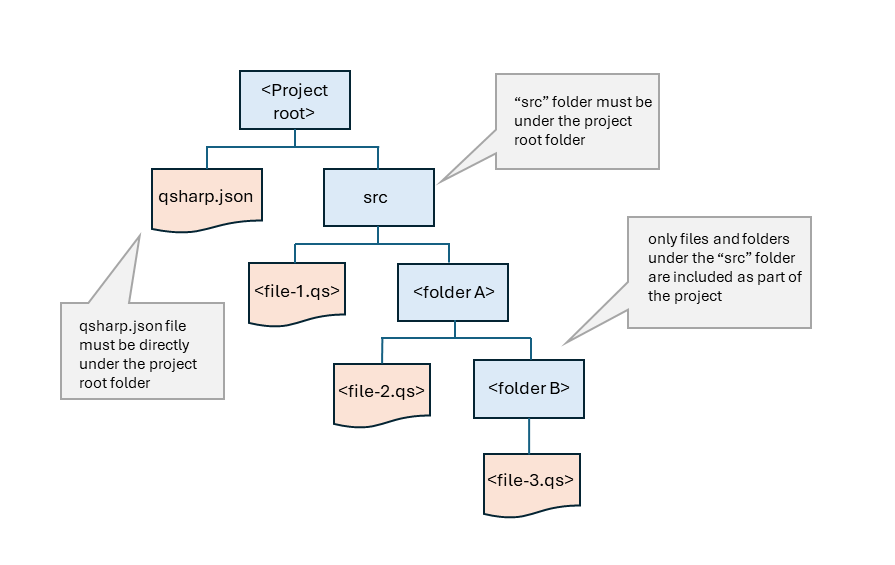

# Work with Q# Projects

With the release of the Azure Quantum Development kit, you can define Q# projects, which are folder strcutures with multiple Q# files that can access each other's resources. Projects are helpful for creating reusable libraries and logically organizing your source code.

A Q# project contains a Q# manifest file, named `qsharp.json` , and one or more `.qs` files in a specified folder structure. When a user opens a `.qs` file in VS code, or sets the `project_root` in a Jupyetr notebook or Python file , the compiler searches the surrounding folder hierarchy for the manifest file and determines the project's scope. If no manifest file is found, the compiler operates in a single file mode. A Q# project can be created manually or dirctly in VS code.


## A Q# project

A Q# project is defined by the presence of a `qsharp.json` manifest file and a **src** folder, both of which should be in the rootfolder of the project. For Q# programs, the Q# compiler detects the projects folder automatically. For Python and Jupyter users, you must specify the Q# project folder with `qsharp.init` call.

based on this repo, the root is `Azure_QRE`
```python
qsharp.init(project_root = '../Azure_QRE')
```


The folder strcutre for a Q# prjects remain the same.




## Create a Manifest file

A manifest file is a simple `.json` file named `qsharp.json` that can optionally include *author, license* and *.ints* fields. The minimum viable manifest file is the strings `{}`, which is autmatically created.

```python
{}
```

### Manifest File Examples


```python
{
    "author":"Microsoft"
}
```

or 

```python
{
    "author":"Microsoft",
    "license":"MIT"
}
```

Within a Q# project, you can also use the manifest file to fine-tune the VS code Q# Linter settings. B

```python
{
    "author":"Microsoft",
    "lints": [
        {
          "lint": "needlessParens",
          "level": "allow"
        },
        {
          "lint": "redundantSemicolons",
          "level": "warn"
        },
        {
          "lint": "divisionByZero",
          "level": "error"
        }
      ]
}
```


## Q# project requirements and properties

The following requirements and configuration apply to all Q# projects.

1. All `.qs` files that you want to be included in the project must be under a folder named **src**, which must be under the Q# project root folder. When you create a Q# project in VS code, the `/src` folder is created automatically.
2. The *qsharp.json* manifest file should be at the same level as the **src** folder. When you create a Q# project in VS code, the *qsharp.json* is autmatically created.
3. Operations and function in available source files can be accessed using `open` statements:

```python
open MyMathLib;
...
    Multiply(x,y);
```


## Steps for creating a Q# project

1. In the VS Code file explorer, right-click the folder you want to use for the Q# project root folder and select Create Q# project, or open the folder and select View > Command Palette > Q#: Create a Q# project....

2. VS Code creates a minimal qsharp.json manifest file in the folder, and adds a /src folder with a Main.qs template file.

3. Edit the manifest file as needed.

4. Add and organize your Q# source files under the /src folder.

5. If you are accessing the Q# project from a Python program or Jupyter Notebook, set the root folder path using qsharp.init. This example assumes your program is in the same folder as the root folder of the Q# project:

```python
qsharp.init(project_root = './Azure_QRE')
```

6. If you are using only Q# files in VS Code, when you open a Q# file, the compiler searches for the qsharp.json manifest file, determines the project root folder, and then scans the subfolder for *.qs files.